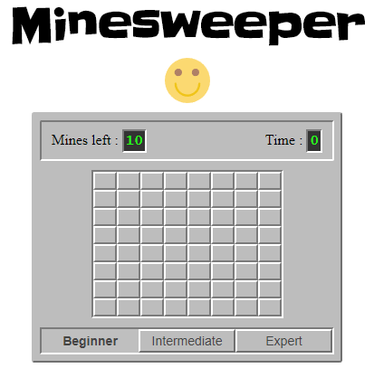

# Minesweeper

Implementation of game [Minesweeper](https://en.wikipedia.org/wiki/Minesweeper_(video_game)) in Javascript, HTML, CSS.



You have 3 difficulties :

1. Beginner : 8 columns, 8 rows and 10 mines.
2. Intermediate : 16 columns, 16 rows, 40 mines.
3. Expert :  31 columns, 16 rows, 99 mines.

You can restart by clicking on the emoticon, and change the difficulty by clicking on the desired mode.

You can play on the [demo]("https://benliev.github.io/Minesweeper/").

## Installation

For install this games :

 ```sh
git clone https://github.com/benliev/Minesweeper
npm install --global bower # if you don't have bower
bower install
 ```

An html file exist for test the game.